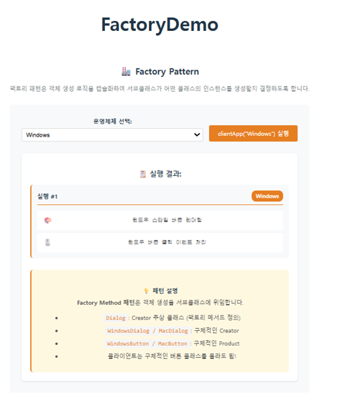
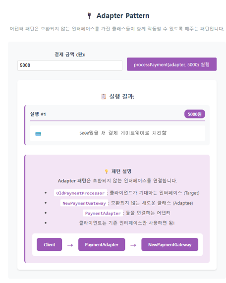
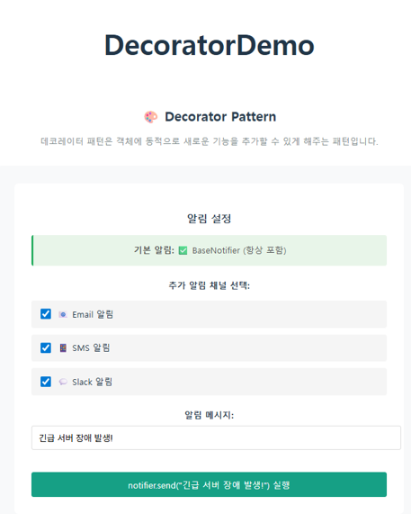
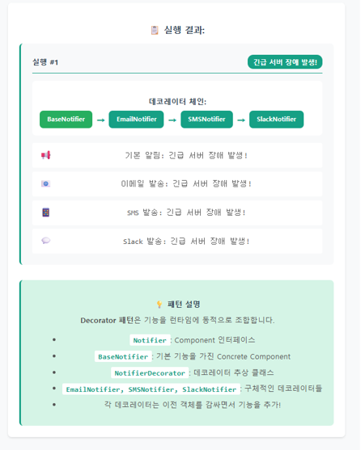
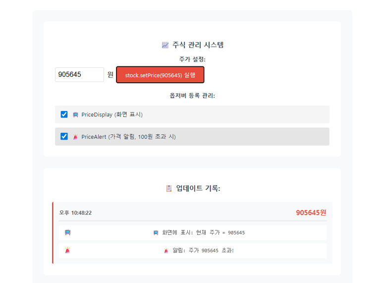
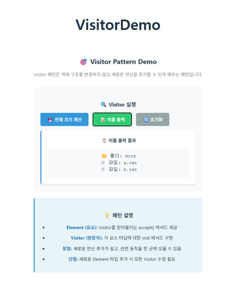

# 객체지향 디자인 패턴 실습 과제

## 1️⃣ 기본 예제 실행 스크린샷

제공된 **6개 디자인 패턴 예제 (Vue + TypeScript)** 코드를 실행해보고,  
각 패턴의 실행 결과 화면을 **캡처**하였습니다.

## 싱글톤(./components/SingletonDemo.vue)

## 팩토리(./components/FactoryDemo.vue)

## 어댑터(./components/AdapterDemo.vue)

## 데코레이터(./components/DecoratorDemo.vue)

  
  

## 옵저버(./components/ObserverDemo.vue)

  
  

## 방문자(./components/VisitorDemo.vue)
