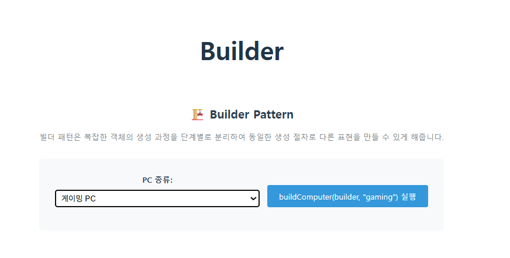
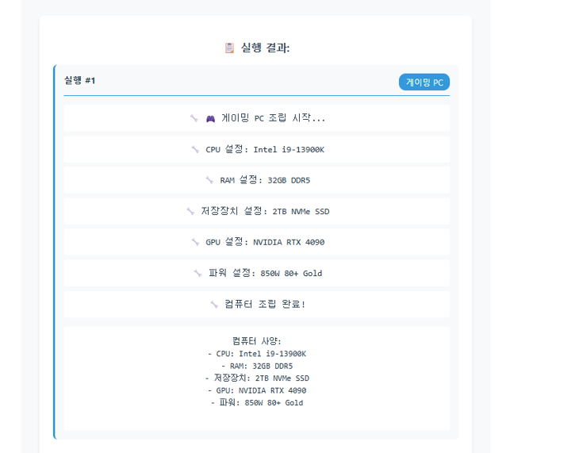
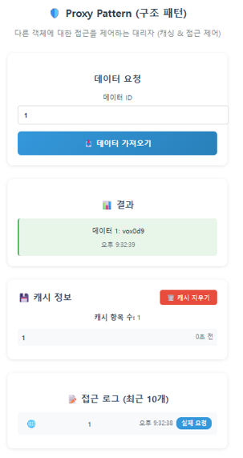
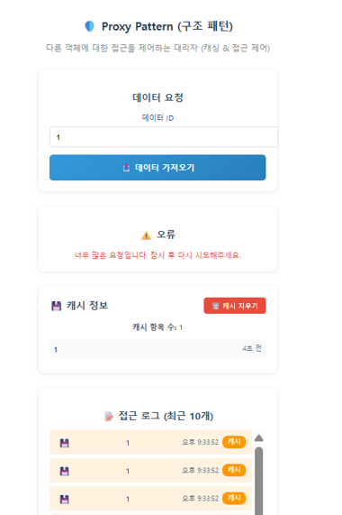
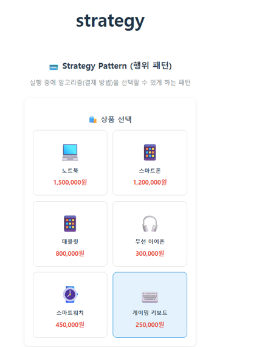
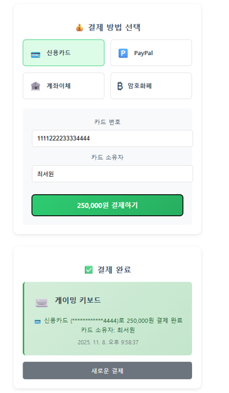

# 객체지향 디자인 패턴 실습 과제

## 1️⃣ 기본 예제 실행 스크린샷

제공된 **6개 디자인 패턴 예제 (Vue + TypeScript)** 코드를 실행해보고,  
각 패턴의 실행 결과 화면을 **캡처**하였습니다.

## 싱글톤(./components/SingletonDemo.vue)

## 팩토리(./components/FactoryDemo.vue)

## 어댑터(./components/AdapterDemo.vue)

## 데코레이터(./components/DecoratorDemo.vue)

  
  

## 옵저버(./components/ObserverDemo.vue)

  
  

## 방문자(./components/VisitorDemo.vue)

## 2️⃣ 실습 구현 과제

아래 세 가지 분류(생성 / 구조 / 행위)에서  
각각 **1개의 디자인 패턴**을 직접 구현하였습니다. 

### 🏗️ 1. 생성 패턴 (Creational Pattern) — **Builder Pattern**

  
  

### 🧱 2. 구조 패턴 (Structural Pattern) — **Proxy Pattern**

  
  

### 🎯 3. 행위 패턴 (Behavioral Pattern) — **Strategy Pattern**

  
  

